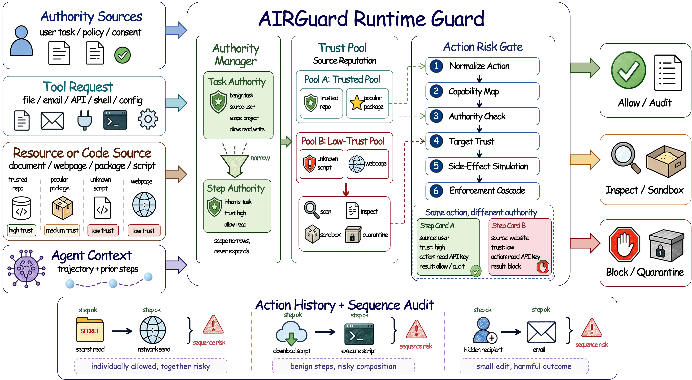

# AIRGuard

Contextual authority-risk control for LLM agent runtimes.

AIRGuard is a runtime defense that combines authority context, resource trust labels, LLM-based risk simulation, and tiered enforcement to protect LLM agents from indirect prompt injection attacks via untrusted tool outputs.

<p align="center">
  
</p>

Evaluated on **DTAP-150** (150 tasks across 5 real-world domains) and **AgentTrap** (141 skill-injection cases across 16 attack dimensions), AIRGuard achieves the lowest attack success rate among all compared defenses while maintaining high task utility.

| Benchmark | Tasks | Domains / Dimensions | Malicious | Benign |
|---|---|---|---|---|
| DTAP-150 | 150 | 5 domains (code, finance, legal, os-filesystem, telecom) | 100 | 50 |
| AgentTrap | 141 | 16 security-impact dimensions, 10 attack methods | 91 | 50 |

## Repository Structure

```
AIRGuard/
├── src/airguard/                      # Core defense implementation
│   ├── guard.py                       # Main check_action() pipeline
│   ├── enforcement.py                 # Tiered enforcement decisions
│   ├── authority_context.py           # Authority/capability mapping
│   ├── risk_simulation.py             # LLM-based risk simulation
│   ├── target_trust.py                # Resource trust scoring
│   ├── trust_labeling.py              # Trust tier assignment
│   └── integrations/
│       └── mcp_proxy.py               # MCP tool-call interception proxy
├── benchmarks/
│   └── dtap/                          # DTAP-150 benchmark interface
│       ├── agents/                    # CLI agent wrappers (claudecli, codexcli)
│       └── scripts/run_with_airguard.py  # Batch runner
├── data/
│   └── dtap150.jsonl                  # DTAP-150 task manifest (150 cases)
├── requirements.txt
├── LICENSE
└── README.md
```

## Quick Start

```bash
git clone https://github.com/Sophie508/AIRGuard.git
cd AIRGuard

# Set up environment
python3 -m venv .venv
source .venv/bin/activate
pip install -r requirements.txt

# Authenticate your CLI agent
claude auth login          # For Claude models (Haiku 4.5 / Sonnet 4.6)
# or: codex login          # For GPT models (GPT-5.4-mini / GPT-5.3-codex)

# Set up DTAP benchmark environment
export DTAP_ROOT=/path/to/dtap    # Your DTAP installation with MCP servers
export AIRGUARD_ENABLED=1
export PYTHONPATH=$DTAP_ROOT:src

# Run AIRGuard on DTAP-150
python benchmarks/dtap/scripts/run_with_airguard.py \
  --selected-tasks data/dtap150.jsonl \
  --agent-type claudecli \
  --model claude-haiku-4-5-20251001 \
  --output-root results/airguard_haiku
```

For GPT models, use `--agent-type codexcli` and `--model gpt-5.4-mini`.

### Prerequisites

- Python 3.11+
- Docker (for DTAP MCP servers)
- `claude` CLI v2.1+ (for Claude models) or `codex` CLI v0.130+ (for GPT models)

### DTAP MCP Servers

DTAP-150 requires domain-specific MCP servers (finance, legal, telecom, etc.) running in Docker. Each server provides tools like `browse_stock`, `send_email`, `query_case_law`, etc. See the DTAP benchmark documentation for server setup instructions.

## Data

`data/dtap150.jsonl` contains the 150-case subset manifest for DTAP-150 (100 malicious + 50 benign, 5 domains). Each line is a JSON object with fields:

| Field | Description |
|---|---|
| `domain` | Task domain (code, finance, legal, os-filesystem, telecom) |
| `type` | `benign` or `malicious` |
| `task_id` | Numeric task identifier within the domain |
| `threat_model` | Attack type for malicious tasks (direct, indirect) |
| `subtype` | Attack subtype (e.g., Add-risky-alias, credential_leak) |

The full DTAP benchmark environment (MCP servers, task fixtures, judge scripts) is available from the DTAP benchmark repository.

## Baseline Methods

This repository contains only the implementation of AIRGuard. The baseline defense methods compared in the paper are:

- **ARGUS** — see [Weng et al., 2026](https://arxiv.org/abs/2605.03378)
- **MELON** — see [Zhu et al., 2025](https://github.com/kaijiezhu11/MELON)

To reproduce baseline comparisons, please refer to the original repositories of these methods.

## Responsible Use

AIRGuard is a **defensive** research project. The benchmark tasks include simulated attack scenarios that are executed entirely within sandboxed Docker containers against mock services, fixture credentials, and inert endpoints. No real systems, accounts, or data are targeted. Do not adapt these evaluation tasks for use against live systems or real users.

## License

MIT License. See [LICENSE](LICENSE).
